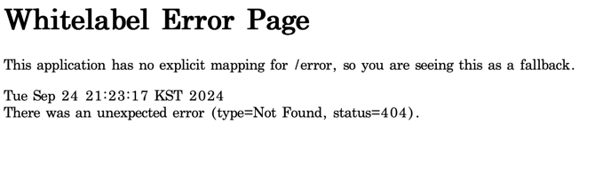

week1 정리
--
- 웹

    컴퓨터들이 정보룰 주고 받는 공간

    웹 안에서 클라이언트 - 서버의 구조로 정보를 주고받음

- 클라이언트 - 서버

    클라이언트 : CRUD 요청을 서버에 전송함

    서버 : 클라이언트의 요청에 대한 응답을 수행하고 전송함

- HTTP
    
    웹에서 사용하는 프로토콜 중 하나인 HTTP
    
    HTTP요청을 보낼 때 HTTP Method, URL 이용

    Http method 에는 get(조회), post(생성), patch(수정), put(수정), delete(삭제) 가 있음

    HTTP헤더 - 언제, 누가 보내는지, http method종류, 요청경로 등을 담음

    HTTP바디 - 주고 받으려는 데이터를 json형식으로 담음

    요청에 대한 상태코드 :
    
    200 - 처리성공
    
    201 - 데이터 생성 성공

    400 - 클라이언트 요청 오류

    404 - 요청 데이터 없음
    
    500 - 서버 에러

- 프론트엔드 - 백엔드

    프론트엔드 : 화면에 가져올 데이터를 백엔드에게 요청 (클라이언트)
    
    백엔드 : DB에서 필요한 데이터를 꺼내 프론트엔드에게 응답 (서버)

- API

    백엔드가 프론트에게 요청을 보낼 때 사용해야하는 http method, url등을 정의한 문서

    그 요청에 대해 어떤 응답을 보낼지 정의하는것
    
    REST API란 REST아키텍처를 따르도록 설계한 api

Api
--
- 유저관리 Api

  POST /join

  POST /login

- 할 일 Api

  할 일 생성 : POST /todo

  할 일 조회 : GET /todo /list

  할 일 수정 : PATCH /todo /{todo_id}

  할 일 삭제 : DELETE /todo /{todo_id}

- 할 일 체크 Api
  
  할 일 체크 : POST /todo /{todo_id} /check 
  
  할 일 체크 해제 : POST /todo /{todo_id} /uncheck

- 친구 Api
  
  친구 추가 : POST /friend
  
  친구 조회 : GET /friend

  친구 삭제 : DELETE /friend /{friend_id}

- 친구 할 일 Api

  특정 친구의 할 일 조회 : GET /friend /{friend_id} /todo /list
  

프로그램 실행 사진
--

