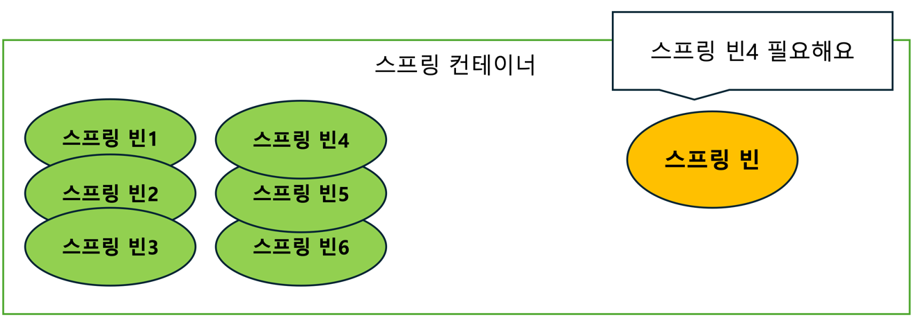

# week3 정리

Spring과 Bean
-

- Spring : java의 프레임워크, 객체지향의 원칙을 준수하며 개발 할 수 있게 해준다.

- Spring Boot : Spring을 이용하여 개발할 때 도움을 주는 도구

외부에서 Api를 tomcat서버가 받아와 스프링 컨테이너 내부의 전용 컨트롤러로 전달해주면, 서버는 DB와 상호작용을 통해 데이터를 가져와 Json형식으로 가공해 다시 외부로 응답을 보낸다.

이떄 스프링 컨테이너 (Application Context) 안에서 사용되는 공용객체를 '빈' 이라고 한다.

스프링 컨테이너에 빈을 저장해두고, 필요한 빈을 컨테이너에서 받아 사용한다. 

빈 과 빈들은 서로를 요구한다. (필요로한다)

스프링 빈을 스프링 컨테이너에 저장하는 방법은 
- 설정 파일 작성 (수동 등록)
- 컴포넌트 스캔 (자동 등록) 두가지가 있다. 

설정 파일 작성은 TestConfig를 이용해 테스트 전용 컨테이너를 생성하고, 그 안에서 빈들을 조회하고 가져온다.

컴포넌트 스캔은 빈을 생성할 클래스에 @COMPONENT 어노테이션을 붙여주면, 어플리케이션 실행시에 @COMPONENT가 붙은 클래스들을 찾아 자동으로 빈 등록해주는 스캔 방법이다. 

의존성 주입
- 

빈을 사용하고 싶을때 컨테이너에 직접 접근해 빈을 꺼내지 않고, 스프링 프레임워크에게 필요한 빈을 요청새 받는다. 

의존성 주입을 받는 이유는 객체지향의 원칙 중 하나인 OCP를 준수하기 위해서이다. 

매번 필요한 객체를 생성하는 것이 아니라, 생성해둔 객체를 사용하므로 메모리를 효율적으로 사용할 수 있다. 

의존성을 주입할때, 객체가 들어오는 구멍(?) 으로 @AUTOWIRED 어노테이션을 사용한다.

의존성 주입에는 
- 생성자 주입, 
- 필드 주입

생성자 주입의 경우 final로 선언하고, 생성자로 초기화한다. 그 후 @AUTOWIRED를 사용해 빈을 주입 받는다

만약 @REQUIREDARGSCONSTRUCTOR을 사용하면 생성자 코드도 생략할 수 있다.

필드 주입은 필드에 바로 final을 붙이지 않고 @AUTOWIRED를 붙이는데, 주로 테스트 코드에서 사용한다.

실제 개발 환경
-

스프링 아키텍쳐에서 컨트롤러란 클라이언트의 요청을 받아 아래 계층으로 응답을 보내는 계층이다.

DTO를 사용해 바로 아래의 서비스 계층과 데이터를 주고 받는다. 

서비스 레이어는 비즈니스 로직을 담고 있는 계층으로, 위로는 컨트롤러, 아래로는 레포지토리 계층과 소통한다

레포지토리 계층은 DB와 소통하며 데이터를 조작하는 계층이다.

Spring에서 컨트롤러, 서비스, 레포지토리는 모두 스프링 빈으로 등록한다. 

테스트 실행 결과
-

