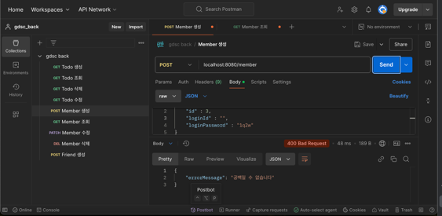
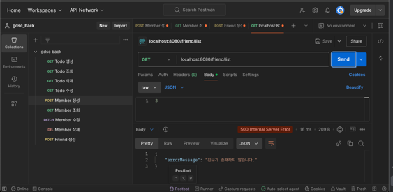

유효성 검사에 대한 대처
-

400 에러 - 클라이언트의 문제 (null, blank)등 가벼운 문제

500 에러 - 문제의 원인이 클라이언트가 아닌 서버에 있음

어플리케이션 자체의 문제 혹은 의도치 않은 예외가 발생했다는 의미로, 중요한 문제가 터졌다는 뜻.

따라서 우리는 그동안의 예외 로직에서 클라이언트가 수정할 수 있는 부분은 400에러로 띄워줘야 한다.

유효성 검사
-

요청으로 들어오는 데이터가 올바른 형식인지 검사하는 것

스프링에서는 데이터를 받아들이는 DTO에서 유효성을 검사한다.
(null, blank) 등

- Global Exception Handler

스프링 어플리케이션 전역에서 발생하는
모든 에러에 대해 어떻게 처리할 지 결정하는 핸들러

Exception타입의 에러가 발생하면 handleUnknownError 메서드가 reoponse객체를 생성해서 응답해준다.

커스텀 예외처리를 통해 내가 원하는 에러를 제공할 수 있다.

BadRequestException메서드를 통해 클라이언트 단에서 발생하는 에러로 다룰 수 있다.

AOP - Aspect-Oriented programming (관점 지향 프로그래밍)

Member, Todo, Friend Controller가 동시에 접근하고 관심이 있는 Global Exception Handler예외처리, Transaction 처리 등이 있다

유효성 검증 실패

비즈니스 로직 에러

