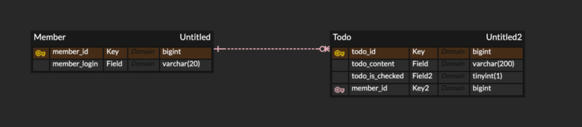
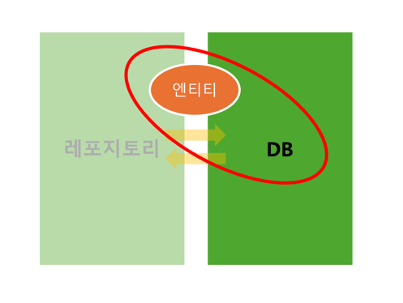
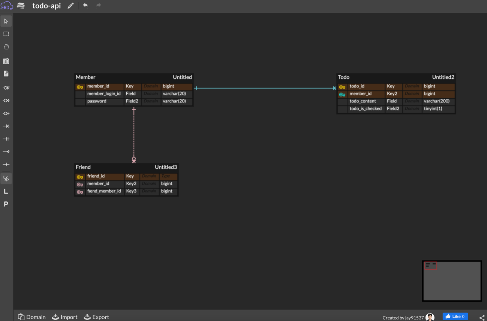
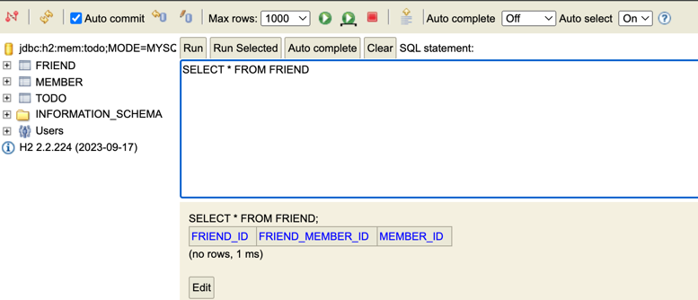
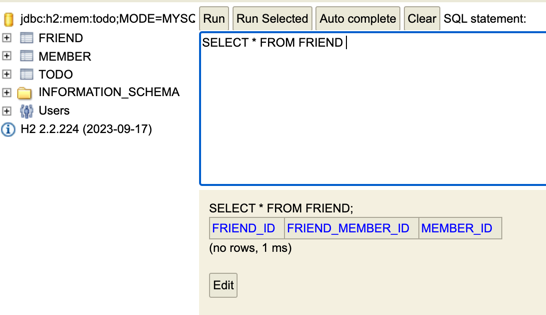
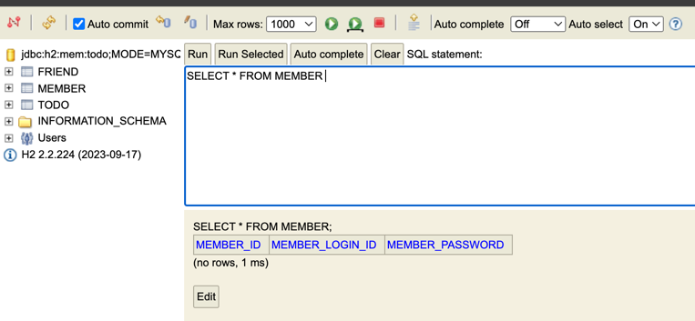

week4
-

# DB 설계

엔티티 : 문제 상황을 구성하는 요소

관계 : 엔티티와 엔티티 사이의 관계

ERD : 문제 상황을 엔티티와 관계로 표현한 후 다이어그램으로 표현

엔티티와 관계는 속성을 가짐, 하나의 엔티티를 식별할 수 있는 속성을 PK(primary key)라고 부른다.

ERD 에서

엔티티 -> 테이블

관계 -> 테이블 or 외래키

속성 -> 테이블 컬럼 

엔티티와 엔티티 사이 

다대일 (N : 1)
일대다 (1 : N)
일대일 (1 : 1)
다대다 (N : M)

식별 관계 : 관계 대상의 PK를 자신의 PK로도 사용하는 것

비식별 관계 : 관계 대상의 PK를 자신의 FK로만 사용하는 것

# JPA

데이터베이스에서 읽어온 데이터를 자바 객체로 매핑하는 자바의 표준기술 (ORM)

엔티티 클래스를 작성하면, JPA가 엔티티 클래스 정의를 보고 테이블을 생성하는 SQL을 알아서 작성하고 실행한다.

→ JPA를 사용함으로써 SQL을 작성하는 시간을 줄일 수 있다.

@ENTITY - 클래스가 엔티티임을 명시

@Id - PK임을 명시

@GENERATEDVALUE - id값 자동으로 생성

@MANYTOONE, ONETOONE 등으로 연관관계 종류를 나타낼 수 있다.

@MANYTOMANY는 테이블로 구현하므로 사용하지 않는다.

fetch 속성으로 연결된 엔티티를 언제 가져올지 명시할 수 있다.

fetch type에는 EAGER, LAZY가 있는데, EAGER는 즉시 로딩, 즉 연결된 엔티티의 모든 정보를 함께 한번에 가져온다.

LAZY는 지연 로딩으로, 연결된 객체 정보를 필요할 때 가져온다.

@NoArgsConstructor를 이용해 인자 없는 생성자를 만들 수 있다.

