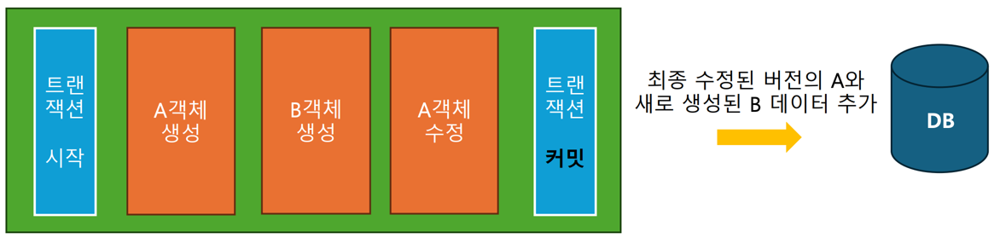
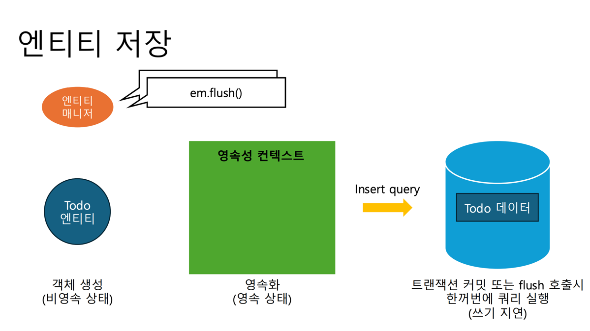

# 레포지토리 계층

DB와 상호작하며 데이터를 조작하는 계층
 &
서비스 계층이 결정한 비즈니스 로직을 실제 db에 적용

4가지 기능 (CRUD)
- 생성 create
- 조회 read
- 수정 update
- 삭제 delete

이를 JPA를 이용해 구현한다.

엔티티 맨니저
-

db와 우리를 연결해주는 객체로, 
새로 생성한 엔티티 객체를 db에 추가, db에 조회한 데이터로 엔티티 객체 만들기, 엔티티 객체에 대한 수, 삭제를 db에 반영하는 역할을 한다.

트랜잭션
-

중간에 에러가 발생할 시 롤백한다

영속성 컨텍스트
-
DB에서 조회한 엔티티를 캐싱하는 공간으로, 엔티티에 대한 변경 사항을 영속성 컨텍스트에 저장해 두었다가,
트랜잭션을 커밋하면 저장된 모든 변경점이 DB에 반영되도록
영속성 컨텍스트를 기반으로 한번에 SQL을 생성한다

조회 시 
- 두번째 조회시에는 DB에 쿼리를 보내지 않고
영속성 컨텍스트에서 가져온다.

수정 시
- 컨텍스트 안에 있는 객체를 수정 시,
수정된 정보와 최초 상태를 비교해서 SQL 생성

- 트랜잭션 커밋 또는 flush 호출시
생성된 쿼리들을 한번에 실행

삭제 시
- 컨텍스트 안에 있는 객체를 삭제 시,
  엔티티를 삭제 상태로 만든다.
- 트랜잭션 커밋 또는 flush 호출시
  생성된 쿼리들을 한번에 실행

간단하게 말하자면, 엔티티 매니저는 변경 사항을 모았다가, 한번에 SQL을 생성하고, 이떄 모든 변경사항은 영속성 컨텍스트에 저장된다

엔티티 매니저에게 데이터 변경을 요청하고 싶다면
하나의 데이터를 나타내는 ‘엔티티 객체’를 영속성 컨텍스트에 올려두고
영속성 컨텍스트에 올려둔 엔티티 객체를 변경하면 된다.