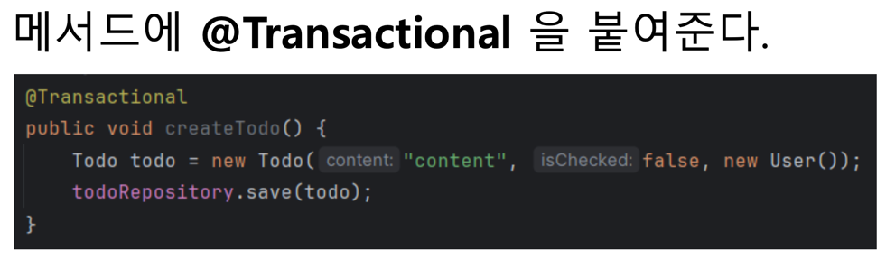
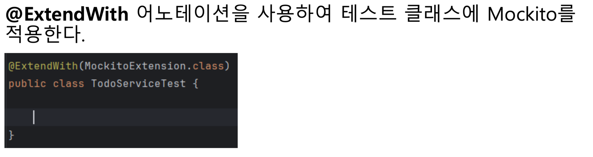
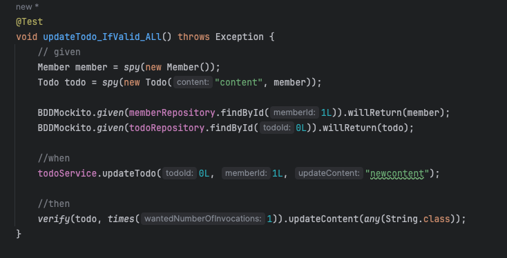
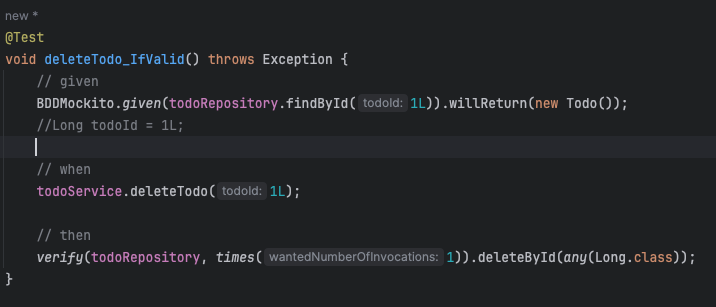
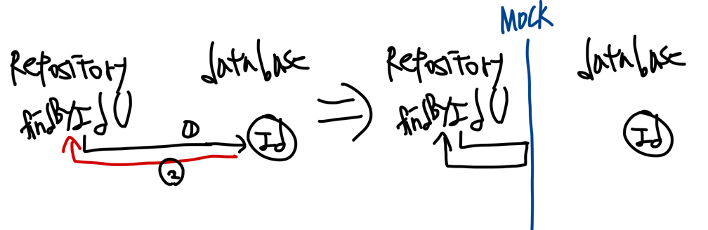

# 서비스계층

어플리케이션의 비즈니스 로직이 담기는 계층

레포지토리 계층과 소통하며 엔티티, 또는 DTO로 소통한다.

1. A 데이터를 생성한다.
2. B 데이터를 생성한다.
3. A, B 데이터를 이용하여 C 데이터를 생성한다.

이와 같은 상황에서 B데이터를 만들다가 에러가 발생한다면 이미 생성된 A데이터는 어떻게 해야 할까?

이 세 로직은 셋다 실행되거나, 셋 다 실행되지 않아야 하는 원자성을 가진 로직이다.

서비스 계층에서 로직의 원자성을 보장하기 위해 메서드 단위로 트랜잭션을 적용해준다.

서비스 계층 테스트는 단위테스트로 작성한다

단위 테스트는 스프링 부트와 다른 클래스에 의존하지 않고, 대상 자바 클래스 하나만 단독으로 테스트하는 것을 말한다.

비스 클래스를 단독으로 테스트하기 위해, 서비스가 의존하는 레포지토리는 가짜 객체를 사용한다.

이 가짜 객체를 가리켜 mock 이라고 한다.

verify() 메서드로 mock 객체의 특정 메서드를 몇 번 호출했는지 검증할 수 있다.

deletebyid의 유효성을 검정하는 테스트 코드인데, deleteById함수가 실제로 todo를 확인하고 삭제하는것이 아니라, todoId만 받아 삭제하기 때문에 코드를 수정해 주었다.

새로 알게된 점
--

리포지토리 계층의 CRUD - 데이터베이스 접근에만 집중

서비스계층의 CRUD - 리포지토리의 CRUD로 가져온 데이터에 비즈니스 로직 더하기, 유효성 검증하기

서비스계층은 리포지토리 계층에서 제공하는 CRUD를 기반으로 해 다양한 비즈니스 로직을 추가해서, 애플리케이션의 실제 기능을 구체화 및 구현한다 라는 나만의 생각

Mockito의 Stubbing은 Mock 객체의 특정 메서드가 호출되었을 때 반환할 값을 정의하는 작업

BDDMockito.given(memberRepository.findById(1L)).willReturn(new Member()); 가 호출되면

이런 느낌으로 이해를  해 보았다.

추가로 생각해볼 것
--
- 친구 관계에서 중복 데이터 현상을 해결할 수 있는 방법

- findByMember에서 친구관계를 가져오는게 아니라 진짜  친구를 반환하기

- friendDeleteTest에서 여러개의 친구 관계를 삭제하는 경우

- 특정 친구의 todo list를 보려면 어떤 jpql을 작성해야 할까?