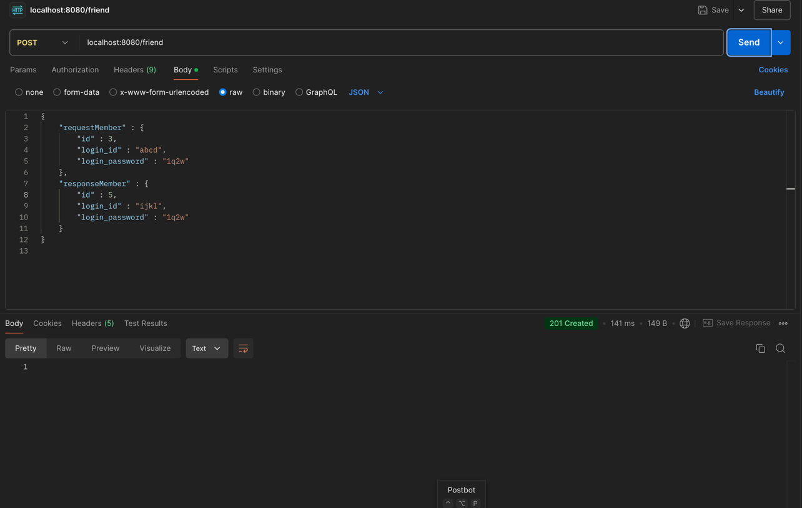

week 9
--

Controller 계층

클라이언트의 요청을 받고, 응답을 보내는 계층

DTO (Data Transfer Object)를 사용하여
서비스 계층과 데이터를 주고받음

그림에서 전용 컨트롤러 에서 db사이에 그 동안 작성한 서비스, 레포지토리, 엔티티 계층이 포함된다.

HTTP 요청을 받은 후 전용 컨트롤러가 요청을 처리하고(requestBody), HTTP 응답으로 반환한다(responseBody)

POST, GET, UPDATE DELETE 등의 메서드를 사용한다.

Request body 데이터는 보통 json 형식으로 들어오며,
메서드 파라미터로 받을 수 있다

이때 들어오는 json형식의 데이터를 자바 객체로 변환하여 받을 수 있는데,
이를 DTO라 한다.

응답에는 결과를 담은 상태코드가 필요하다.

200 -> 처리성공 (ok)
201 -> 데이터 생성 성공 (created)
400 -> 클라이언트 요청 오류 (bad request)
404 -> 요청 데이터 없음 (not found)
500 -> 서버 에러 (internal server error)

컨트롤러의 테스트는 POSTMAN을 이용

-성공예시-

성공적인 멤버 조회

성공적인 친구 관계 형성

-실패예시-

4번 멤버의 친구를 조회하려 했으나 4번은 친구관계가 없으므로 
'친구가 존재하지 않습니다' 출력 

느낀점?
--
유효성 검사로직을 어디에 두어야 하는지 생각해보았다.

예를들어 회원가입 로직을 구현할때, 서비스 단계에서 객체의 유효성검증까지 다 하고 있으면
서비스 코드가 무거워져 효율적이지 않다는 생각이 들었다.

찾아보니 필터 단계에서 유효성검증을 한다고도 하는데,

아직 이해가 잘 되지 않아서 공부를 해보려 한다.

그래서 내가 내린 결론은 도메인 내에서 유효성 검증을 하는 것이다.

도메인 내에서 회원가입의 유효성 검증이나, 다른 비즈니스 로직에 필요한 검증을 해준다면 서비스 로직이 훨씬 간단해질 것이다.

하지만 도메인 단계가 무거워질 수 있는데, 도메인을 따로 분리한다면 해결할 수 있지 않을까..라고 생각한다.

예를들면 User 도메인에서 회원가입 로직을 검증하는 UserLoginId, UserLoginPassword 도메인을 따로 두는것이다.